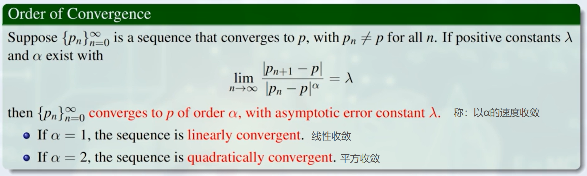

# Solutions of Equations in One Variable 单变量方程的求解问题
## Ⅰ: The Root-Finding Problem 寻根问题

### The Bisection Method 对分搜索法
  

## Ⅱ: Fixed-Point Iteration 不动点迭代方法

### Fixed-Point Theorem

**Corollary:**

*收敛速度完全取决于k，k越小，$k^n$ 越小，$p_n$ 越接近于p，且收敛速度越大。*  

### Example

## Ⅲ: Newton's Method 牛顿迭代方法
### VS Fixed-Point Problem:
#### Similarity:
是一种特殊的不动点迭代

#### Difference:
收敛速度快得多

 

### 牛顿定理的收敛性证明:

**Proof:**
*即证：满足Fixed-Point Problem Theorem的两个条件。*

 

## Ⅳ: Error Analisis for Iterative Method 误差与性能分析

### 一般的不动点迭代

 

**特殊情况 之 g'(p) = 0:**

### Newton's Method

