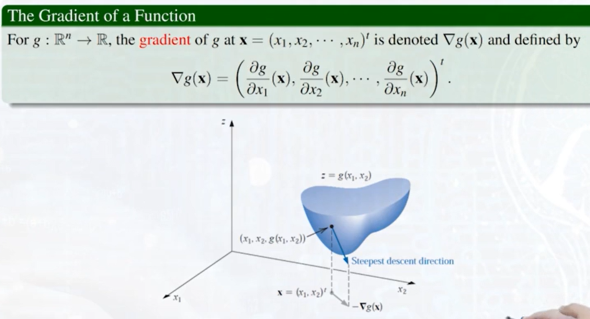

# Nonlinear Systems

## Ⅰ : Fixed Points for Functions of Several Variables

### Theorem

*将非线性系统的多个方程依次构造成每个变量的不动点问题，迭代即可。*  
*更快速的办法是已有的 $x_i^{(k)}$也直接代入当前第 k 次迭代要用的函数中。*

## Ⅱ : Newton's Method for Nonlinear Systems

### Theorem

**简单求矩阵的逆的方法：**

### Gradient Descent Techniques
#### Background:
牛顿迭代法需要一个零点附近的p，如何寻找合适的p？

#### Solution:
最陡下降法指的是为 g 寻找一个局部最小值。
首先代入初始值 x(0)，根据 x(0)得到 g 下降的方向，沿着这个方向移动合适的距离得到 x(1)。重复步骤即可。
1. 构造 g(x)

2. 递降 逼近

3. 公式

#### Gradient Descent vs. Newton's Method:
