# The Solution of Linear Systems

## 矩阵相关概念和性质
### Ⅰ：Norm: （范数）
**Definition:**

**Theorem / Corollary:**

### Ⅱ：Special Radius: （谱半径）
**Definition:**

即最大的特征值。

#### Eigenvalues & Eigenvectors （特征值&特征向量）：
Ax = λx

**特征向量的物理意义：**
满足上述方程的非零向量 x ，表示在矩阵 A 的作用下，该向量的方向不变（仅被缩放 λ 倍）。
**特征值的物理意义：**
表示特征向量被拉伸或压缩的比例。
λ > 1：拉伸  
0 < λ < 1：压缩  
λ < 0：反向
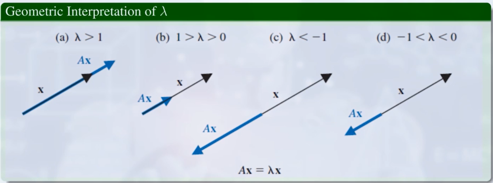

#### 回到谱半径：
若 ρ(A) < 1 , 则矢量x无论与什么矩阵A相乘，都会变短。

### Ⅲ：收敛矩阵：

**等价表述：**
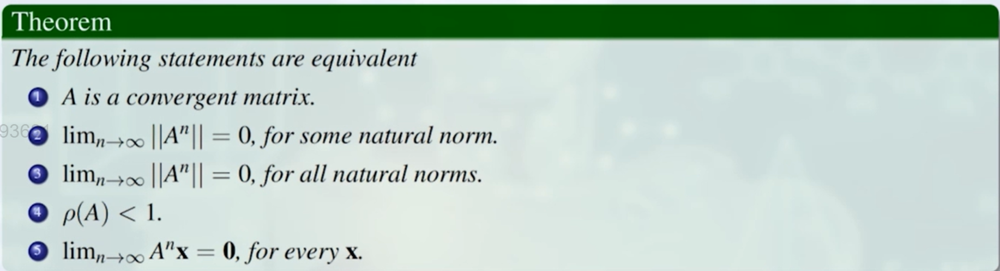

## 线性问题的迭代求法
**思路：**
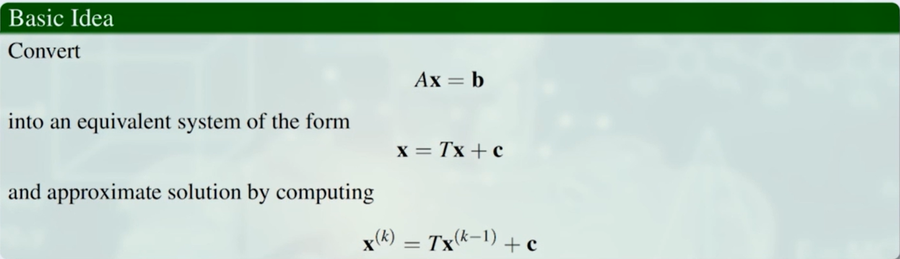

### Ⅰ：The Jacobi Iterative Method（雅可比迭代法）
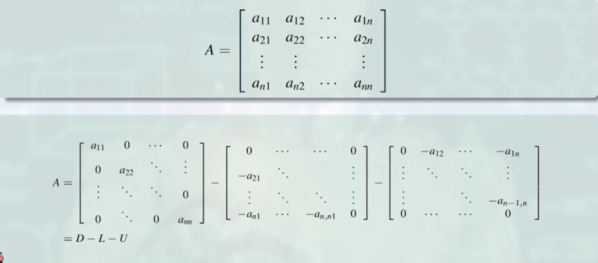
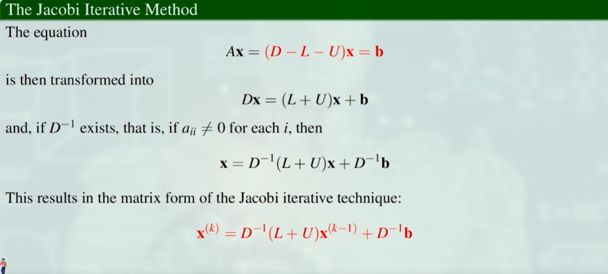
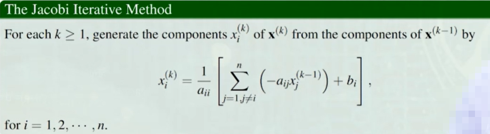
*$x^{(k)}$ 全部用 $x^{(k-1)}$ 表示*
#### Example:
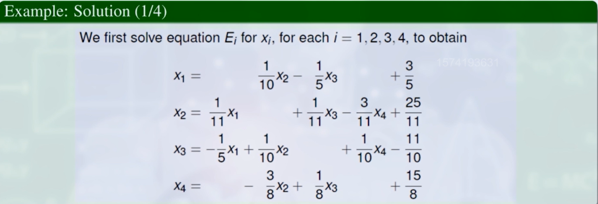
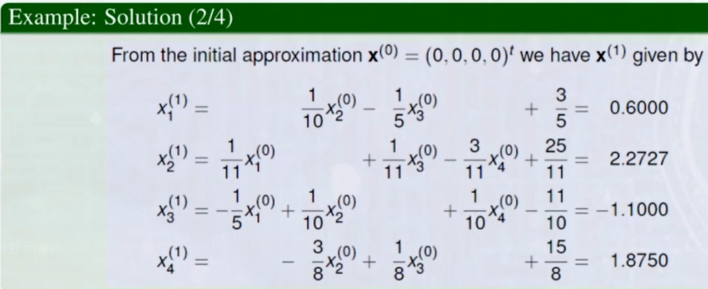
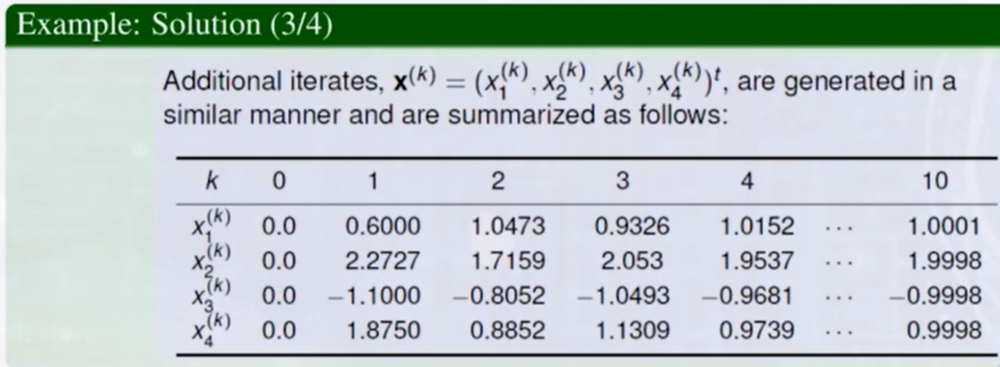

### Ⅲ：The Gauss-Seidel Method（高斯-塞德尔迭代法）
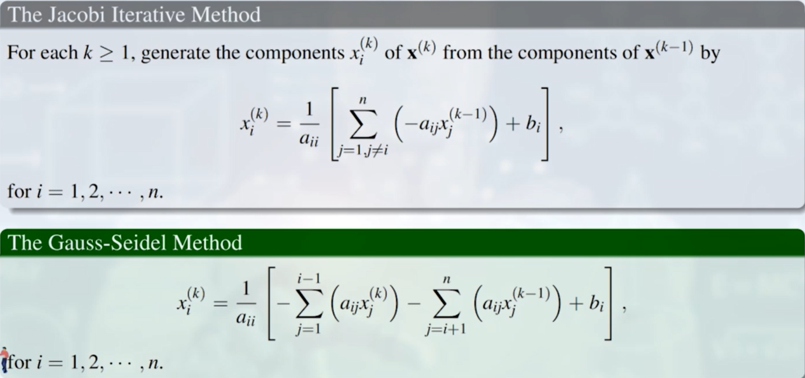
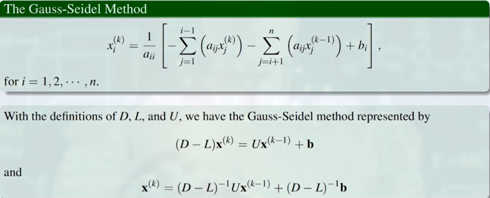
ps. D-L是一个下三角矩阵
#### Example：
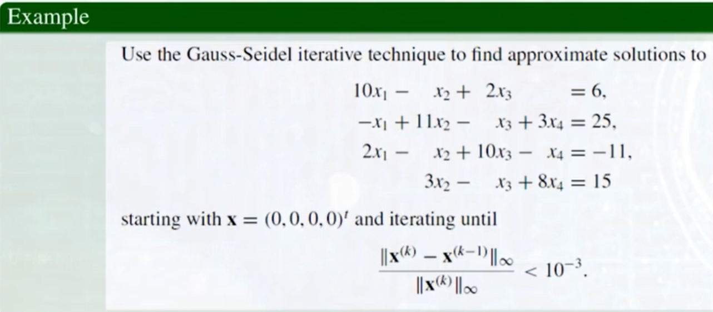
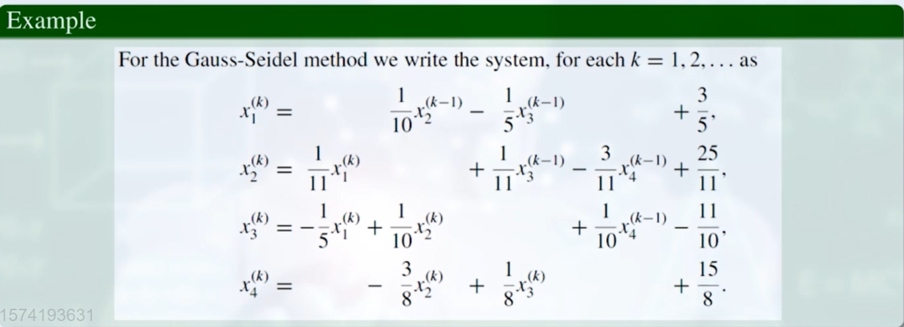
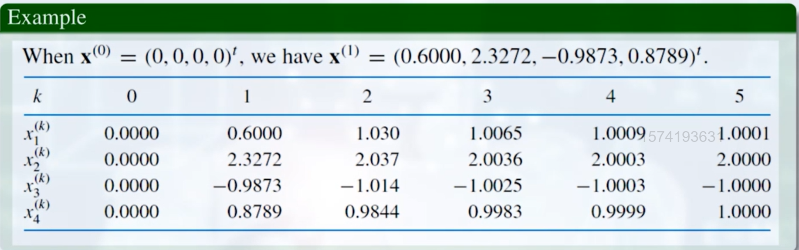

### Ⅳ：迭代算法的收敛性分析
（能否收敛 & 收敛快慢）
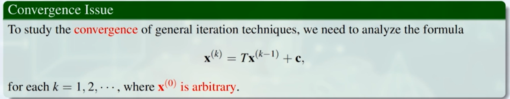
#### 一、收敛条件：
**引理：**
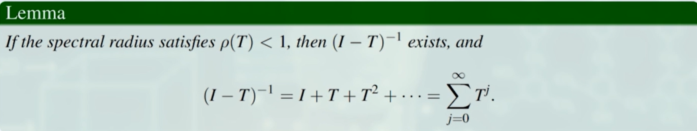
**引理的证明：**
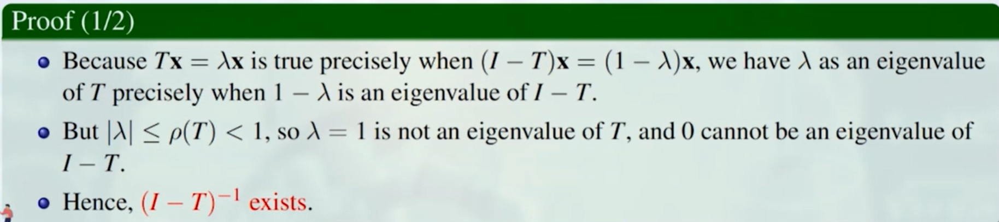
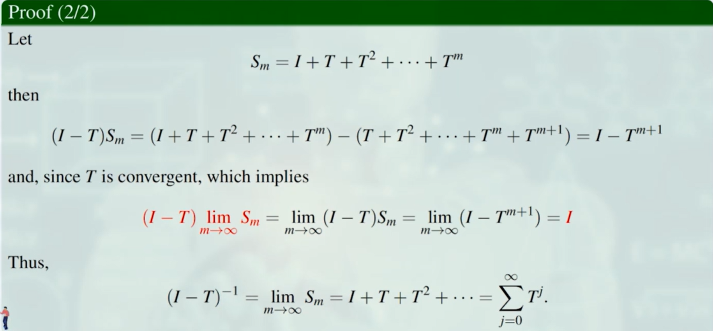

**矩阵收敛的等价表述：**

**Theorem:**
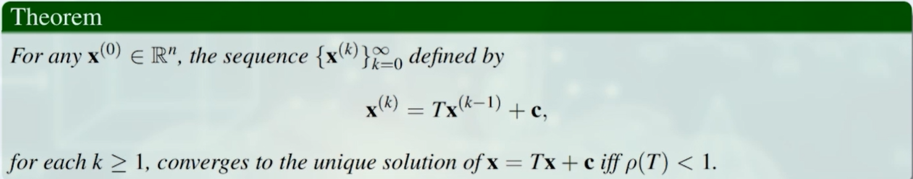
*与谱半径相关。*

**定理的证明**
1. 充分性：
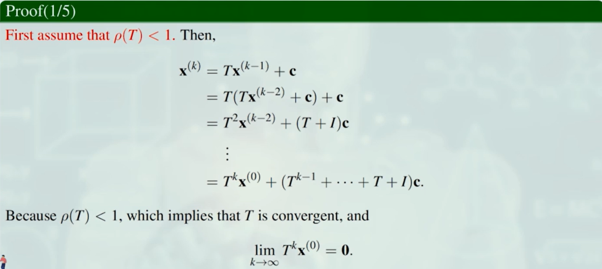
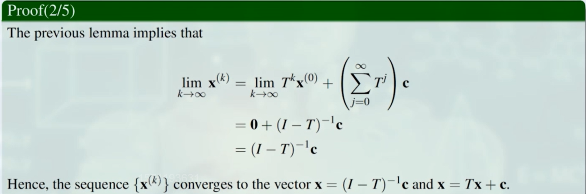  
2. 必要性：
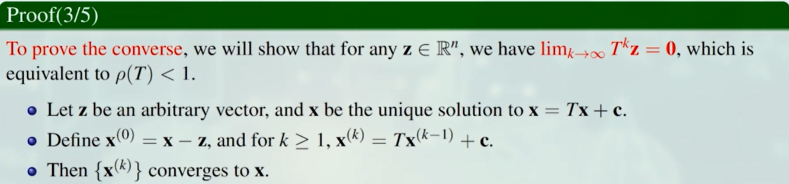
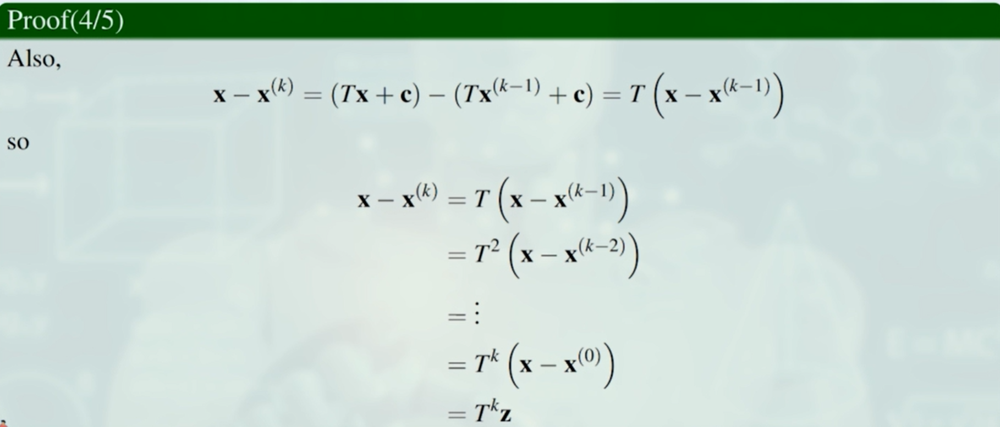
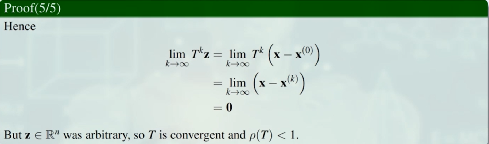

#### 二、收敛速度：
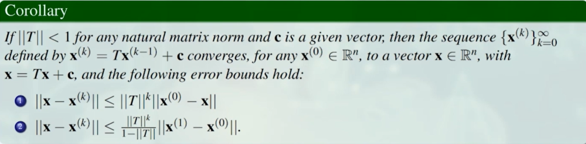
*完全取决于||T||，即T的谱半径。*

#### 三、雅可比迭代 & 高斯-塞德尔迭代 的收敛条件

