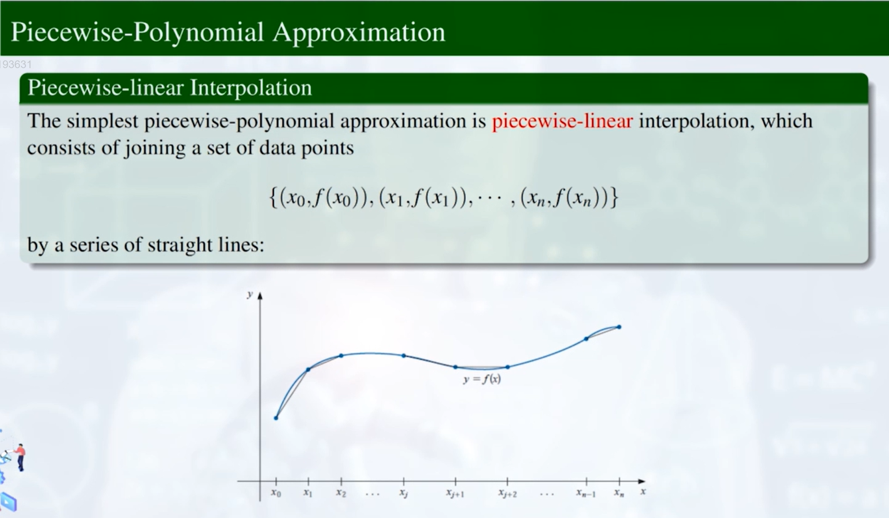
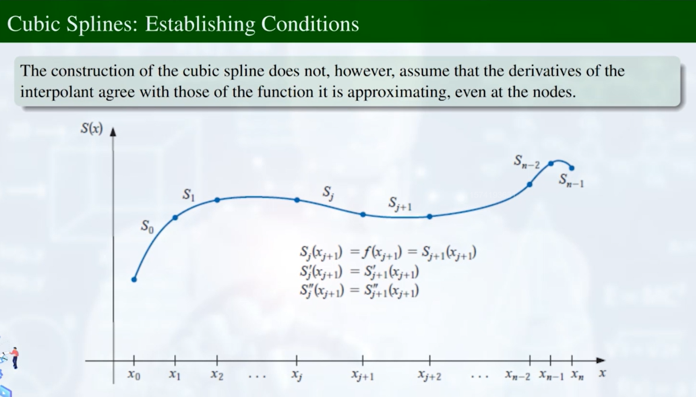
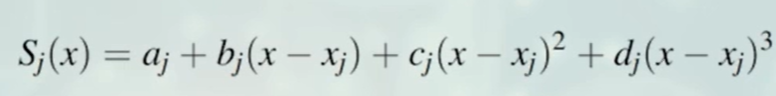
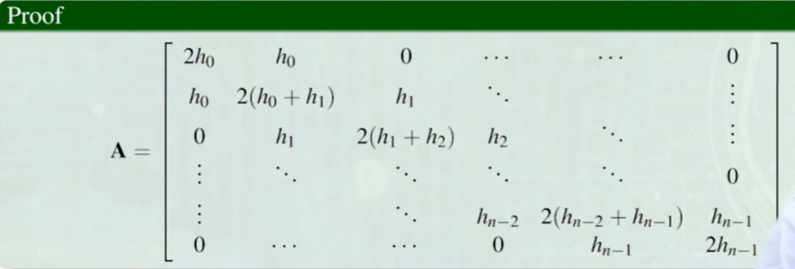

# Interpolation & Polynomial Approximation（多项式拟合和近似）
*核心思想和主要目标：根据 n+1 个点，构造 n 阶多项式。*

## Ⅰ：Interpolation & Taylor Polynomials （内插法与泰勒多项式）

### 一、多项式拟合

**Definition:**

**Advantages:**

1. 连续性
2. 便于求导和积分  

**存在性：Weierstrass Approximation Theorem（维尔斯特拉斯定理）**

示意图：

### 二、Taylor Polynomials

**误差分析：**
泰勒多项式只能做到在一个点上展开是非常精确的，而在一个区间上上可能误差很大。

*泰勒多项式不能来做内插问题！*

## Ⅱ：Lagrange Interpolating Polynomials （拉格朗日内插多项式）
**引入：**
经过两个点，构造拉格朗日多项式。

#### 构造n阶拉格朗日多项式：（经过 n+1 个点）

**Theorem：**

Example：

#### 误差上界分析：
**Theorem：**

Proof：（巧妙；可忽略）

#### 局限：
f(x)往往没有给出表达式，所以无法求高阶导。

## Ⅲ：Neville's Method （内维尔迭代法）
给定 n+1 个点
1. 取 k+1 个点构造 k 阶拉格朗日多项式

2. 迭代

## Ⅳ：Piecewise-Polynomial Approximation （分段的多项式近似）
### 一、引入：（拉格朗日多项式的局限）
1. 要找的多项式数量太大。
2. 阶数太高，会导致误差放大。

**Solution：分段的思路**
不需要一条多项式经过所有点，而是每 k 个（如每2个）点构造一个多项式。

### 二、Simplest Solution：三次样条插值
1. 一阶线性内插  
即：每2个点构造一阶多项式。

由图可见，在给定的点处，不连续。不符合构造条件。
2. 二阶
即：每2个点构造二次多项式。  
分析：  
n 条二次多项式，需要 3*n 个参数。  
而已知：①每条多项式经过2个点，-> 可以得到 2*n 个限制条件；②相邻两条多项式在交点处的导数（即切线方程）相同，-> 可以得到 n-1 个限制条件。③左右端点处会得到至少2个限制条件。  
自由度不够，所以无法构造。

**所以至少需要3次！**
**一元三次多项式的构造方法，也称：三次样条插值。**
分析：  
每个区间上需要4变量，总共需要确定 4*n 个参数。
已知：①每条多项式经过2个点，-> 可以得到 2*n 个限制条件；②相邻两条多项式在交点处的一阶导数（即切线方程）和二阶导数相同，-> 可以得到 2*(n-1) 个限制条件。③左右端点处，-> 得到2个限制条件。  
综上所述：需要确定的参数数量和限制条件数量完全吻合！  
示意图：

**Definition：**

## Construction of a Cubic Spline (构造三次样条插值)

$a_j$ = f($x_j$)
$h_j$ = $x_{j+1}$ - $x_j$
解方程：
Ax = b
### 一、Natural Spline Interpolant 自然样条插值
**Theorem：**

**Proof:**

解方程：Ax = b  
求：c -> b -> d
### 二、Clamped Spline Interpolant 紧压样条插值
**Theorem：**

**Proof：**

解方程：Ax = b  
求：c -> b -> d

## Ⅴ：Approximation Theory 近似理论
#### 一、Introduction:

1. 给定多个点，寻找一个函数来近似
2. 给定一个函数，寻找一个更简单的函数来近似

#### 二、用线性函数来近似

求解 $a_0$,$a_1$  

**为什么选择第3个（最小二乘近似方法）？**
- 为了求解 $a_0$,$a_1$，往往需要求导，而前两种方法带有绝对值，不方便求导，第3种方法便于求导。

**求解步骤：**
1. 

2. 求偏导

3. 

**矩阵表述：**

#### 推广至 n 阶
已知条件：给定 m 个点，要求求出最近似的 n 阶多项式。  
1. 当 n = m - 1：直接求解拉格朗日内插多项式即可。  
2. 当 n < m - 1：

