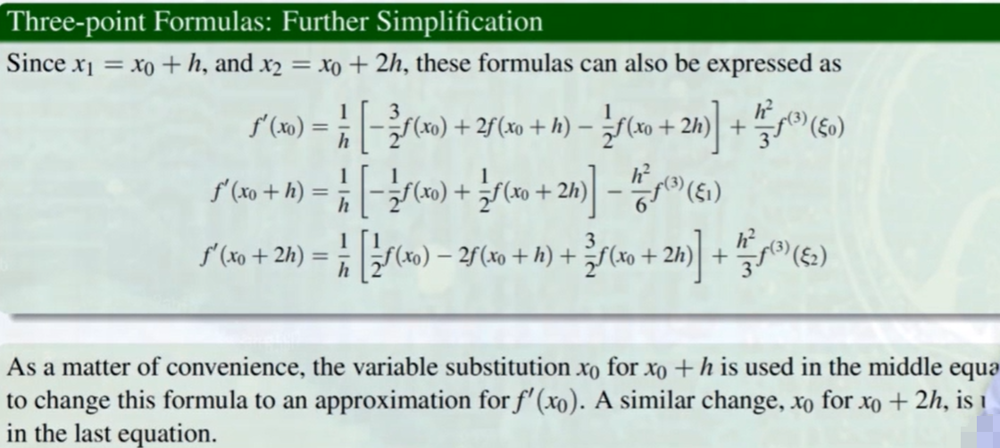

# Numerical Analysis

## Ⅰ：Introduction to Numerical Differetiation 数值微分的介绍
#### 微积分引入：

但是误差会很大
#### 引入拉格朗日插值多项式：

将 x = $x_0$ 代入 f'(x)  =>  
**结论：**

**示意图：**

## Ⅱ：General Derivative ApproximationFormulas 通用公式

#### 构造：利用拉格朗日插值多项式（L）

结果：

#### 三点公式：即 n = 2
**推导：**

**结论：**
（2）优于（1）：  
误差是（1）的1/2；运算用到的点少

**示意图：**

#### 五点公式：

下面的公式优于上面的。

#### 高阶微分公式：（以二阶为例）

**结论：**

## Ⅲ：Round-Off Error Instability 数值微分对于舍入误差的不稳定性
#### 引入舍入误差：

#### 分析：

## Ⅳ：Richardson's Extrapolation 理查森外推方法
*通过迭代产生更高精度。*
#### 以二阶为例：

$N_2$(h) 比 $N_1$(h) 更精确。
#### 外推至更高阶：

#### Attention！
阶数越高 -> n 越大 -> h/$2^n$ 越大 -> 舍入误差越大 ！
