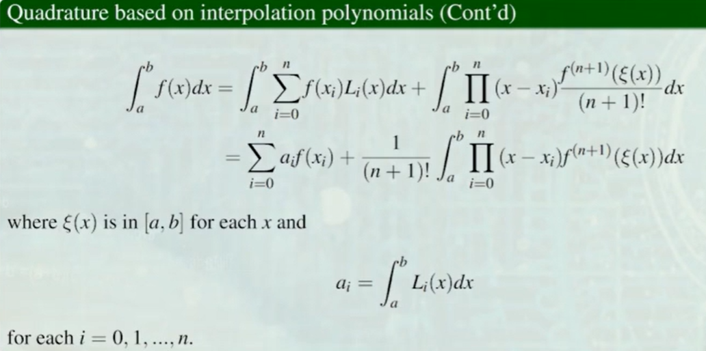
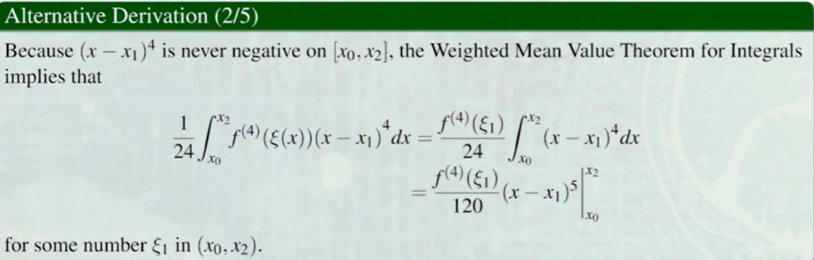
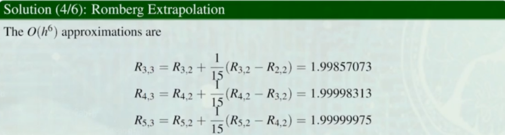
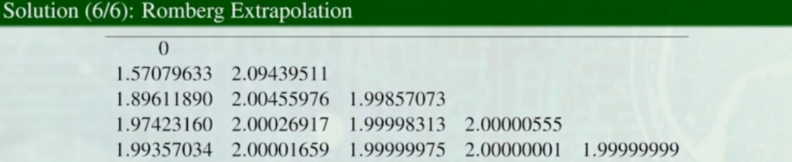

# Numerical Analysis 数值积分

## Ⅰ：Numerical Integration Methods 数值积分基本方法
#### 一、基本思路：
n+1 个点 -> 构造 n 阶**拉格朗日插值多项式** -> 对该多项式积分

**表达式：**

E(f)是残差。

#### 二、Trapezoidal Rule 梯形法则：
*即用一次线性函数去近似。亦即二点数值积分。*
示意图：

证明：
1. 写出拉格朗日插值多项式，并积分

2. 对残差项积分

3. 最后结果：

#### 三、Simpson’s Rule 辛普森法则：
*即三点数值积分，多加了一个中点。*
示意图：

正常思路：

想要更精确的······
*用泰勒插值多项式：*

结论：

#### 四、Newton-Cotes Formulas：
梯形法则和辛普森法则其实是Newton-Cotes公式的特殊情况。
**公式：**

特值代入：

## Ⅱ：Composite Numerical Integration 组合数值积分

#### 一、辛普森法则

**公式：**

**与一般数值积分方法的精确度比较：**

#### 二、梯形法则
示意图：

**公式：**

#### 三、舍入误差分析
以辛普森法则的公式为例：

*最终的舍入误差与计算数量无关。即，n可以很大，每次的计算区间很小。*

## Ⅲ：Romberg Integration 龙贝格积分方法
注意到：组合数值积分，会在原积分的基础上误差阶数变小。  
如：梯形法则 由$0$($h^3$)降为$0$($h^2$) ；辛普森法则 由$0$($h^5$)降为$0$($h^4$)。  
为了提高精度，考虑理查森外推法！
**思路：
梯形法则 + 组合数值积分 + 理查森外推法**  
#### 公式推导：
下面以梯形法则为例：

需满足的收敛条件：
  
#### Example:

可见，最后一行的结果已经非常接近精确的积分结果 2 了。
