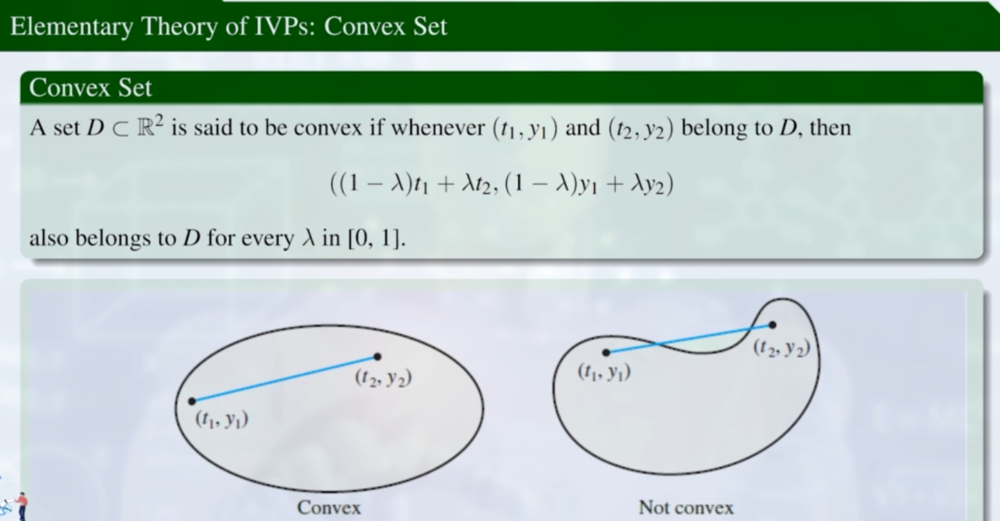
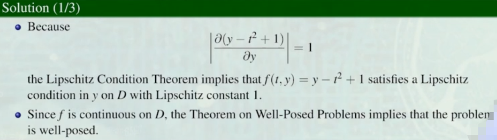
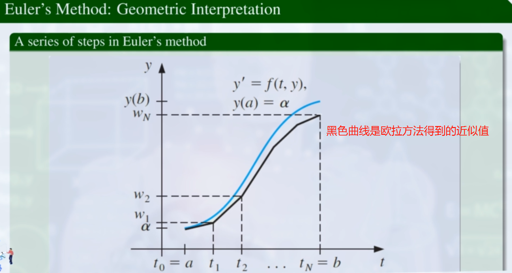
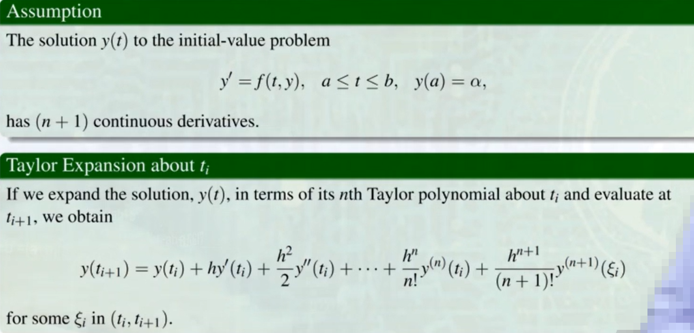
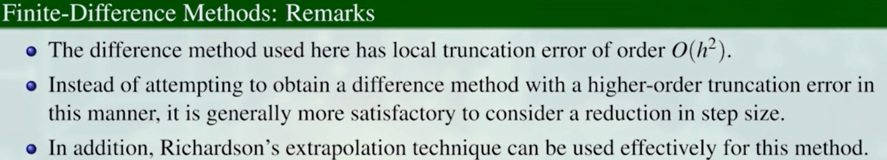

# Solution of Differential Equations 微分方程的数值解法

## Ⅰ：Initial-Value Problems for ODEs 常微分方程中的初值问题
对一个常微分方程（或方程组）在给定初始条件下求解的问题。
#### 一、Introduction:

不同于数学上的常微分方程的解法。  
此处的常微分方程是用有限个点，去近似得到一个函数。或者只需要求 n 个点的函数近似值即可。
#### 二、 Lipschitz连续
**Definition：**

反例：

**凸集：**

**Lipschitz 连续的充分条件：**

#### 三、良态问题
**Definition：**

**Theorem：**

*良态问题的意义：δ(t)是函数z(t)的误差项。根据定理显示，带有误差的 z(t) 与常微分方程 y(t) 的差值不超过 ke ，即误差是有界的。*
**Example：**
Q:

A:

验证：y(t)是可解的。

## Ⅱ：Euler's Method 欧拉方法
#### 一、Object：

求 N+1 个点处的函数近似值
#### 二、Solution：泰勒多项式

w是取了y的近似值。

**示意图：**

#### 三、误差上界：

（证明略）

#### 四、舍入误差：

δ 是每次迭代产生的舍入误差  
L：Lipschitz常量  
M：y''(t) 的上界  
a：t 的下界  
$t_i$：由 i 、a、b 确定  
只有 h 是变量

#### 五、Comments：关于 y''(t)  
劣：误差较大。  
优：*在未知 y(t) 的情况下，欧拉方程中 y''(t) 实际上是可求的。*

## Ⅲ：Higher-Order Taylor Methods 高阶泰勒方法
#### 一、Object:
提高欧拉方法的精度。

#### 二、局部截断误差：

*假设 $y_i$ 是精确的，即 $ω_i$ = $y_i$，在此基础上分析 $y_{i+1}$ 的误差。*  
**欧拉方法的局部截断误差 如下：**

#### 三、分析欧拉方法的局部截断误差：

#### 四、Motivation:
*提高精度，即由 $0(h)$ -> $0(h^p)$*

#### 五、Solution:
**泰勒展开至更高阶。**
1. 泰勒展开至 n 阶

2. 利用迭代

3. 化简

4. 公式

最终误差项满足 $0(h^n)$
#### 六、Theorem:
*泰勒展开至 n 阶，即 n+1 阶是 $y^{(n+1)}(ξ_i)$，满足精度为 $0(h^n)$ 。*

**Proof:**

## Ⅳ：Runger-Kutta Methods 龙格库塔方法
#### 一、引入：
高阶泰勒方法需要多次求高阶导数，计算太复杂！

#### 二、Solution

构造：

解得：

验证：

#### 三、Midpoint Method $0(h^2)$

#### 四、3 阶 $0(h^3)$

#### 五、4 阶 $0(h^4)$

## Ⅴ：Systems of Differential Equations 求解微分方程组

#### 一、Systems of Differential Equations 微分方程组

代入龙格库塔方法

#### 二、Higher-Order Differential Equations 高阶微分方程

## Ⅵ：Boundary-Value Problems for ODEs 常微分方程的边值问题

#### 一、Introduction：

**Theorem：存在性 & 唯一性**

（证明略）

#### 二、The Linear Shooting Method 线性打靶方法
**线性边值问题：**

**Solution：**
1. 构造2个初值问题。对于每一个初值问题，可以用龙格库塔方法求解。

2. 线性叠加

**验证合法性：**
即带入检验

**示意图：**

**Example：**

#### 三、Finite-Difference Methods 有限差分方法
**Solution：**
1. 差分为 N+1 个区间（ N+2 个点，其中首位两个是边值条件）

有点类似欧拉方法的思路。
2. y''，y' 近似至 $0(h^2)$  ，考虑**数值微分中的三点公式和高阶微分公式**（见Lecture 6）

3. 得到 N 个线性方程，构造 N $\times$ N 矩阵

注意到：该矩阵为对角严格主导矩阵，故 Aw = b 一定有解。

**提高精度：**

*理查森外推法具有通用性！*

**有限差分方法用于解决非线性问题：**

左边是y''，右边是f，x，y，y'

不一定有解。  
但是当 h < 2/L 时，一定有解。